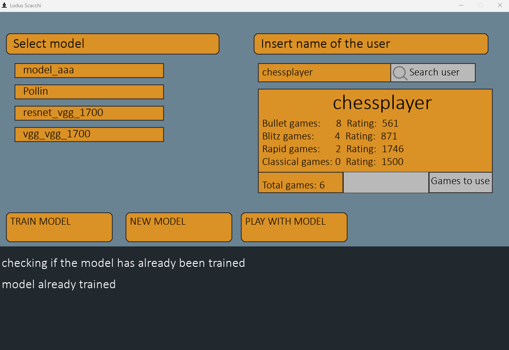
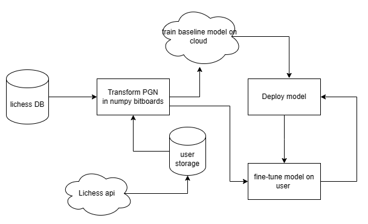

# Ludus_scacchi

This chess app uses keras to train CNN models on lichess games of different users.
You can then play with those engines.
There are 3 major functionalities:
 - you can fine tune base-line keras models on lichess users
 - you can analyse with your models 
 - you can play with your models

future versions might allow you to create unique traning programs based on a model and generate positions where a lichess user is more likely to make mistakes. 

## Why ludus 
There are a lot of chess engine that have been made and most of those focus on finding the best move.  This of course can lead very powerfull analysis but it does not create a very effictive traning partner. That is beacuse your opppenont plays in a perfect manner and it's simply unnatural.  

Ludus attmepts to create the ideal sparring partner by prediciting what a real human would play simulating a real life 

## Installation

to install simply run the follwing command :

        git clone https://github.com/paolomostardi/ludus_scacchi.git

and then run the program with 

        python main.py

to run you need the follwing modules: 

- tensorflow 
- keras
- pygame
- pychess
- pandas
- numpy

## Training on users 

To train on lichess users you can simply use the application 

just write the name of the user then click search user after that either click train model to finetune a model or new model to make a new model.
click then play with model to start a game.

### training on non lichess users

if you wish to train on non-lichess users you can create a folder in training_data/data/NAMEOFPLAYER/bitboard
if you have a file that cointains many pgns files you can simply run the follwing script: 

        pyhton
        from Backend/pipeline import from_PGN_generate_bitboards as gen 
        gen.generate_from_filename(NAMEOFPLAYER,0,FILEPATH,0,SAVINGPATH)

your saving path will most likely be the one above. 

## Pipeline

Above is a diagram of the current pipeline.  
Here we can see that the initial model is trained with data from the lichess database to be a generic chess player of elo 1700.
Cloud computional resources have been used to train the model. 
The model is then deployed to the desktop application. 
The user can then download automatically games of a lichess user form their API and fine tune different models on it. 

## Model architecture 

The final model is made by 2 keras models and it splits the output in 2.  
One model determines which piece should move while another model determine where the piece will move.  
The first model uses a Resnet like architecture while the second uses a VGG like architecture. The input is a 8x8x14 for the first model and 8x8x15 for the second model.  The output of the model is a softmax function applied to a 64 array in both models. 

